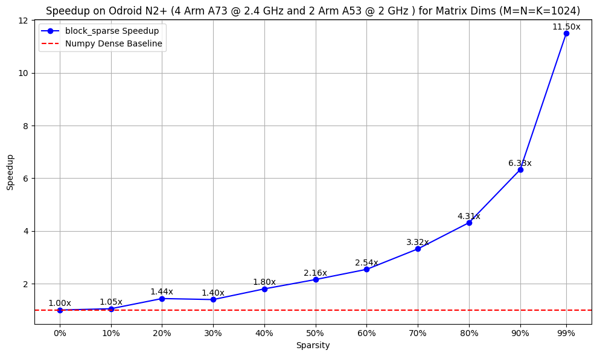
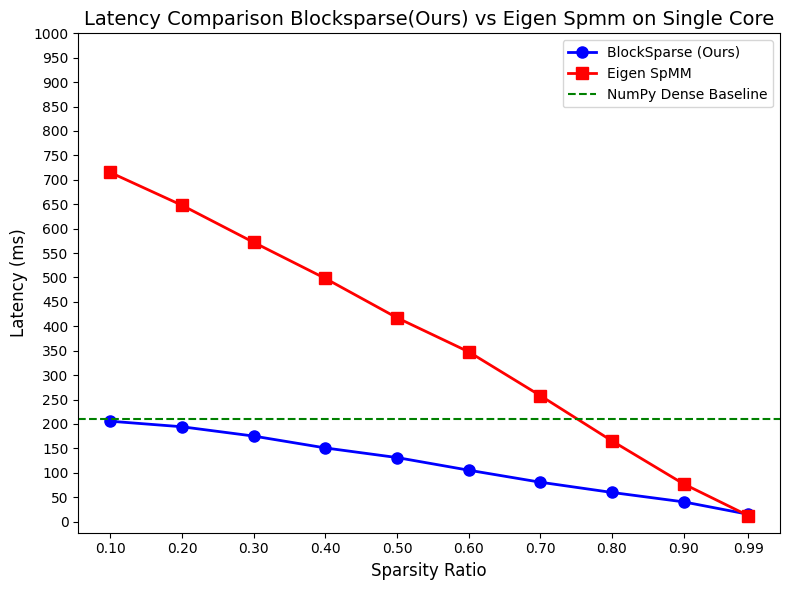

# Block Sparse Matrix Multiplication for ARM CPUs

<div style="display: flex; justify-content: space-between; align-items: center;">
    
    
</div>

## Features
- Optimized block sparse matrix multiplication for 64-bit ARM CPUs, with kernels designed for custom block row-major and block column-major formats, outperforming traditional sparse block row/column formats.
- Compatible with NumPy, enabling seamless integration.
- Demonstrates speedup at low sparsity levels starting from 10%, unlike other libraries that require high sparsity (>80%) for performance gains
- Multi-threaded implementation for enhanced performance across a wide range of sparsity ratios (10% and above).
- Support for configurable block sizes and efficient matrix format conversion (e.g., row-major to block-major).
## Source Code 
- Developed ARM NEON ISA assembly kernels for enhanced control and speedup. The library is use only using python wheels. If you need source code for kernels , please submit request at alee.rehmaann@gmail.com

## Future Development
- Currently, the library is available only via Python wheels. Future releases will include C++ library files for broader usage.
- Based on community requests, we plan to add block-sparse support for Intel x86 CPUs with Intel AVX and SSE instructions.

## Installation

### Prerequisites
- Python 3.8, 3.9, or 3.10
- NumPy
- 64-bit ARM CPU

### Installing via pip
Pre-built wheels are provided for Python 3.8, 3.9, and 3.10.

### Installing from Source Wheels
To build from source, clone the repository and install dependencies:

```bash
git clone https://github.com/yourusername/block_sparse.git
cd block_sparse
pip install -r requirements.txt
pip install wheels/block_sparse-0.1.0-cp310-cp310-linux_aarch64.whl # choose from available wheels 
```

## Usage

The library provides utilities to create block sparse matrices, perform efficient matrix multiplication, and benchmark performance against NumPy. Below is an example demonstrating how to use the library:

```python
import numpy as np
import block_sparse
from utils import make_block_sparse_matrix, benchmark_matmul

# Create random matrices
M, N, K = 192, 768, 3072
A = np.random.uniform(0, 1, (M, N)).astype(np.float32)
B = np.random.uniform(0, 1, (N, K)).astype(np.float32)

# Apply block sparsity to B
B = make_block_sparse_matrix(B, block_size_row=4, block_size_col=4, sparsity_ratio=0.5)

# Create block_sparse tensors
A_tensor = block_sparse.create_tensor(
    np_array=A,
    is_sparse=False,
    block_size_row=8,
    block_size_col=4,
    current_format=block_sparse.MatrixFormat.ROW_MAJOR,
    convert_format=block_sparse.MatrixFormat.ROW_BLOCK_MAJOR
)
B_tensor = block_sparse.create_tensor(
    np_array=B,
    is_sparse=True,
    block_size_row=4,
    block_size_col=4,
    current_format=block_sparse.MatrixFormat.ROW_MAJOR,
    convert_format=block_sparse.MatrixFormat.COLUMN_BLOCK_MAJOR
)

# Run benchmark
runs = 15
sparse_avg, numpy_avg = benchmark_matmul(A, B, A_tensor, B_tensor, runs)

# Print results
print(f"Benchmark Results for {runs} runs:")
print(f"Average time per block_sparse run: {sparse_avg:.6f} ms")
print(f"Average time per NumPy run: {numpy_avg:.6f} ms")

# Result matrices
C = block_sparse.matmul_blocked(A_tensor, B_tensor)
C_np = np.matmul(A, B)
```

## Important Notes on Block Sizes
- **Warning**: The kernels are optimized for specific block sizes:
  - Matrix A must use a block size of 8x4 (rows x columns).
  - Matrix B must use a block size of 4x4 (rows x columns) or larger block sizes that are integer multiples of 4 (e.g., 8x8, 16x16, etc.).
- Ensure that matrix dimensions are consistent with the chosen block sizes to avoid errors. For example, the number of rows and columns in A and B must be divisible by the respective block sizes.

## Key Functions
- `make_block_sparse_matrix(matrix, block_size_row, block_size_col, sparsity_ratio)`: Converts a dense matrix to a block sparse matrix with specified block sizes and sparsity ratio.
- `block_sparse.create_tensor(np_array, is_sparse, block_size_row, block_size_col, current_format, convert_format)`: Creates a block sparse tensor from a NumPy array, with options for sparsity and format conversion.
- `block_sparse.matmul_blocked(tensor_a, tensor_b)`: Performs block sparse matrix multiplication.
- `benchmark_matmul(A, B, A_tensor, B_tensor, runs)`: Benchmarks block sparse matrix multiplication against NumPy's `matmul`.

## Supported Platforms
- **Python Versions**: 3.8, 3.9, 3.10
- **Architecture**: 64-bit ARM CPUs
- **Operating Systems**: Linux, macOS (ARM-based)

## Performance
The library is optimized for ARM CPUs and can provide significant speedups over standard NumPy matrix multiplication for sparse matrices, depending on the sparsity ratio and block size configuration. Use the `benchmark_matmul` utility to evaluate performance for your specific use case.

## Contributing
Contributions are welcome! Please submit a pull request or open an issue to discuss improvements, bug fixes, or new features.

## License
This project is licensed under the MIT License. See the [LICENSE](LICENSE) file for details.